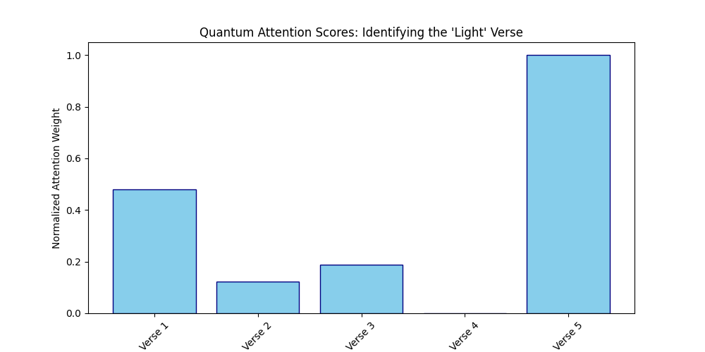
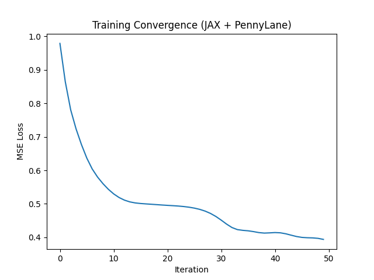
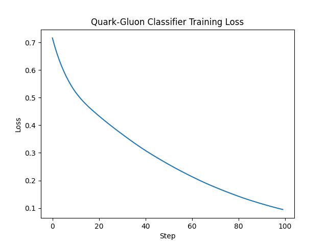

# GSoC-2026-Research
"This repository contains my research, technical evaluations, and proof-of-concept implementations for GSoC 2026, specifically focusing on the Quantum Particle Transformer (Q-ParT) project under ML4Sci."

This repository leverages expertise in high-fidelity sequence modeling—initially developed through the engineering of the KJV-Bible-LLM dataset—to optimize attention mechanisms for High Energy Physics (HEP) jet classification.

# Visual Results

### Quantum Attention Demo


### Training Convergence


### Quark-Gluon Classification


# Reproducibility

1. Configure the Google Colab Environment
Before running any code, you must enable the GPU:

Go to Edit > Notebook settings.

Select T4 GPU (or any available accelerator) under "Hardware accelerator."

Click Save.

2. The "Researcher's Setup" (Cell 1)
In the first cell of your notebook, use these commands to install the GPU-optimized versions of your tools. This configuration uses CUDA 12, which is standard for 2026 environments.

```
# Install PennyLane with GPU support
!pip install pennylane pennylane-lightning-gpu custatevec-cu12 --upgrade

# Install the JAX-CUDA plugin to ensure hybrid gradients are accelerated
!pip install "jax[cuda12_pip]" -f https://storage.googleapis.com/jax-releases/jax_cuda_releases.html

# Optional: Install Catalyst for "Just-In-Time" (qjit) compilation
!pip install pennylane-catalyst
```

3. Verifying the Setup (Cell 2)
Use this script to confirm that your KJV Bible dataset logic or Quantum Transformer code is actually hitting the GPU.

```
import jax
import pennylane as qml

# Check JAX devices
print(f"JAX Devices: {jax.devices()}") 
# Should output: [GpuDevice(id=0)]

# Check PennyLane GPU support
dev = qml.device("lightning.gpu", wires=4)
print(f"Using PennyLane device: {dev.short_name}")
```
