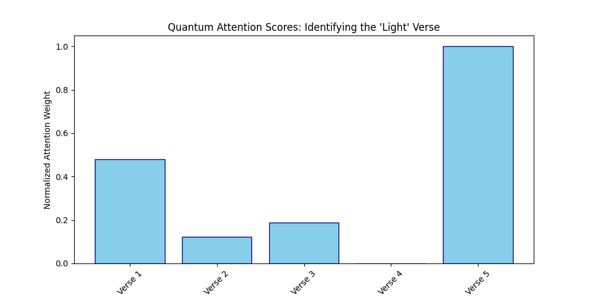
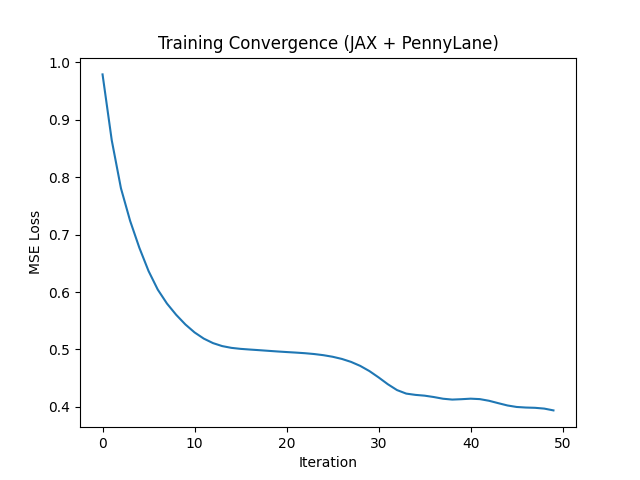
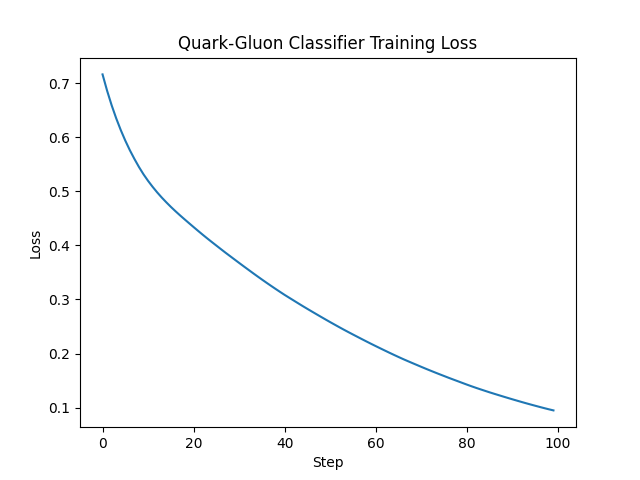

# 🌌 GSoC 2026: Quantum Particle Transformer (QMLHEP7)

[](https://summerofcode.withgoogle.com/)
[](https://ml4sci.org/)
[]()

Welcome to my central research repository for the **Google Summer of Code 2026** application with **Machine Learning for Science (ML4Sci)**. 

This repository houses my project proposal, literature review, and initial prototyping for the **Quantum Particle Transformer for High Energy Physics Analysis at the LHC (QMLHEP7)** project.


## 📋 Project Overview

The High-Luminosity Large Hadron Collider (HL-LHC) program will require massive computing resources to identify rare physics signals against immense backgrounds. This project explores Quantum Machine Learning (QML) as a new paradigm to address the ever-growing demand for computing resources in High Energy Physics (HEP).

The primary goal of this project is to develop a hybrid **Quantum Particle Transformer (Q-ParT)** using the PennyLane framework. By incorporating Variational Quantum Circuits (VQCs) and Quantum Orthogonal Neural Networks (QONNs), the project aims to demonstrate improved time complexity and generalization in HEP tasks like jet tagging and particle classification.


## 🔗 Important Links

* **Full Project Proposal (PDF):** [Link to your uploaded PDF proposal here]
* **ML4Sci QMLHEP Evaluation Tasks:** [ML4Sci-QMLHEP-GSoC2026-Evaluation](https://github.com/r-karra/ML4Sci-QMLHEP-GSoC2026-Evaluation) *(Contains my successful completion of the required test tasks)*
* **Official Project Description:** [QMLHEP7 on ML4Sci](https://ml4sci.org/gsoc/2026/proposal_QMLHEP7.html)

## 🗂️ Repository Structure

```text
GSoC-2026-Research/
├── proposal/
│   ├── RajeshKarra_QMLHEP7_Proposal.pdf    # Final submitted GSoC Proposal
│   └── draft_materials/                    # LaTeX source and draft notes
├── literature_review/
│   └── paper_summaries.md                  # Notes on QML, Transformers, and HEP papers
├── prototypes/
│   ├── classical_baseline/                 # Initial classical ParT scripts
│   └── quantum_circuits/                   # PennyLane VQC and QONN experiments
└── README.md


[](https://summerofcode.withgoogle.com/)
[](https://opensource.org/licenses/MIT)

# GSoC-2026-Research
"This repository contains my research, technical evaluations, and proof-of-concept implementations for GSoC 2026, specifically focusing on the Quantum Particle Transformer (Q-ParT) project under ML4Sci."

This research leverages my background in large-scale sequence modeling—refined through the development of the KJV-Bible-LLM dataset—to optimize Attention mechanisms for High Energy Physics (HEP) signal detection.

# Visual Results

### Quantum Attention Demo


### Training Convergence


### Quark-Gluon Classification


# Reproducibility

1. Configure the Google Colab Environment
Before running any code, you must enable the GPU:

Go to Edit > Notebook settings.

Select T4 GPU (or any available accelerator) under "Hardware accelerator."

Click Save.

2. The "Researcher's Setup" (Cell 1)
In the first cell of your notebook, use these commands to install the GPU-optimized versions of your tools. This configuration uses CUDA 12, which is standard for 2026 environments.

```
# Install PennyLane with GPU support
!pip install pennylane pennylane-lightning-gpu custatevec-cu12 --upgrade

# Install the JAX-CUDA plugin to ensure hybrid gradients are accelerated
!pip install "jax[cuda12_pip]" -f https://storage.googleapis.com/jax-releases/jax_cuda_releases.html

# Optional: Install Catalyst for "Just-In-Time" (qjit) compilation
!pip install pennylane-catalyst
```

3. Verifying the Setup (Cell 2)
Use this script to confirm that your KJV Bible dataset logic or Quantum Transformer code is actually hitting the GPU.

```
import jax
import pennylane as qml

# Check JAX devices
print(f"JAX Devices: {jax.devices()}") 
# Should output: [GpuDevice(id=0)]

# Check PennyLane GPU support
dev = qml.device("lightning.gpu", wires=4)
print(f"Using PennyLane device: {dev.short_name}")
```
